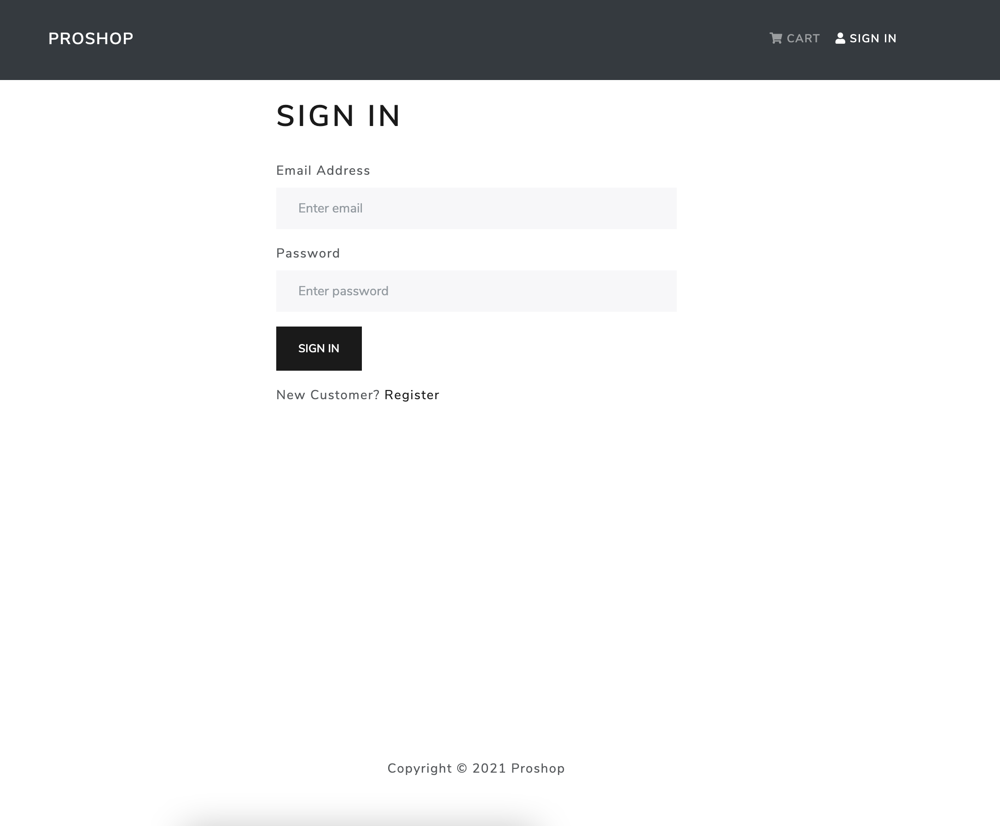

# Proshop Ecommerce App

Proshop is ecommerce project, built with using MERN Stack (ReactJs, ExpressJS, MongoDB) and with Typescript.

[DEMO](https://shr-proshop.herokuapp.com/)
## Features

- Email Authentication with JWT
- Data Validation with [Joi](https://github.com/sideway/joi)
- Fully typed MongoDB schema with [mongoose](https://mongoosejs.com/) and [mongoose-ts](https://github.com/lstkz/ts-mongoose)
- Frontend Built with React, Typescript and [Bootstrap-react](https://react-bootstrap.github.io/)
- State Management with [zustand](https://github.com/pmndrs/zustand)
- ... More to come

## Screenshots

